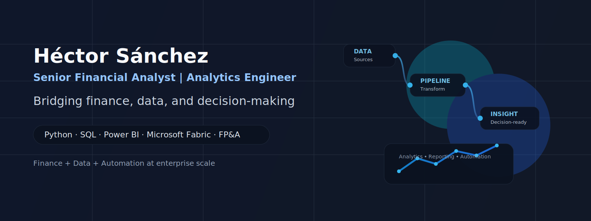

  

## Hi there, I'm Héctor Sánchez 👋

I work at the intersection of **finance, data, and automation**.

My background started in **accounting, audit, and corporate finance**, and over time evolved into **analytics engineering, business intelligence, and decision systems**. Today I focus on building data workflows that help finance and business teams move faster and think more clearly.

### What I do

- Build analytics systems for finance teams
- Automate reporting workflows with **Python** and **SQL**
- Create dashboards and decision-ready models with **Power BI** and **Microsoft Fabric**
- Translate between business needs and technical implementation
- Turn complex enterprise data into useful operational and financial insight

### Core tools

`Python` `SQL` `Power BI` `Microsoft Fabric` `Snowflake` `DuckDB` `Pandas` `NumPy` `DAX` `Azure`

### Focus areas

- Finance analytics and FP&A
- Reporting automation
- Business intelligence
- Data modeling and decision systems
- Data science and AI applied to business problems

### A few things I’ve worked on

- Automated revenue and expense reporting for enterprise finance organizations
- Built data pipelines and reporting layers that reduced reporting cycles from days to hours
- Developed vendor normalization and spend analytics solutions for better decision-making
- Created dashboards for FP&A, compliance, and operational teams
- Worked across companies such as **KPMG, Motorola, ON Semiconductor, Flex, HP/HPE, Micro Focus / OpenText, and Weave**

### Current direction

Right now I’m focused on improving **finance analytics workflows**, **automation**, and **decision systems** using modern data tooling.

### Connect

- 🌐 Website: [cfocoder.com](http://www.cfocoder.com)
- 💼 GitHub: [@cfocoder](https://github.com/cfocoder)
